# Домашнее задание к занятию "13.4 инструменты для упрощения написания конфигурационных файлов. Helm и Jsonnet"
В работе часто приходится применять системы автоматической генерации конфигураций. Для изучения нюансов использования разных инструментов нужно попробовать упаковать приложение каждым из них.

## Задание 1: подготовить helm чарт для приложения
Необходимо упаковать приложение в чарт для деплоя в разные окружения. Требования:
* каждый компонент приложения деплоится отдельным deployment’ом/statefulset’ом;
* в переменных чарта измените образ приложения для изменения версии.

## Ответ.

Создал стандартый чарт.

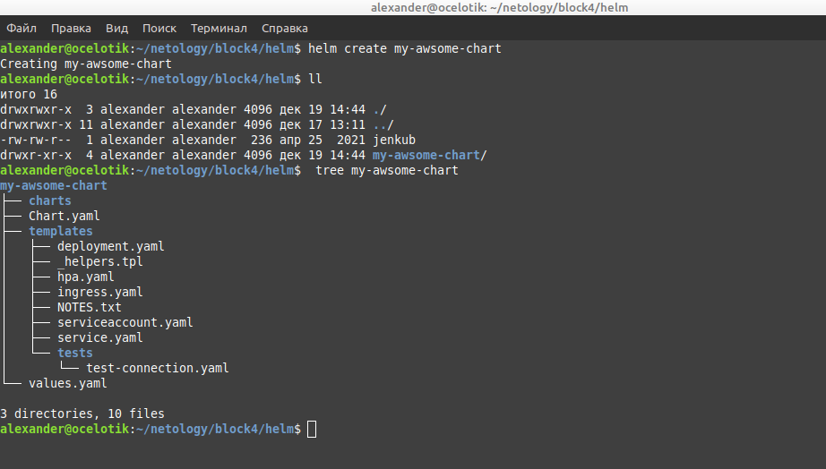

В качестве приложения использовал докер образ взятый из одного из домашних заданий по докер,
собранный из докер-файла на основе убунту и jenkins:

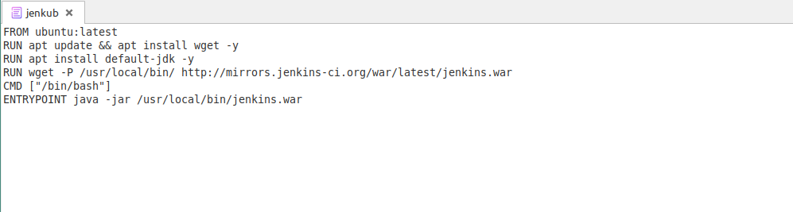

Внес изменения в файл с переменными, для того, чтобы развернулось мое приложение:

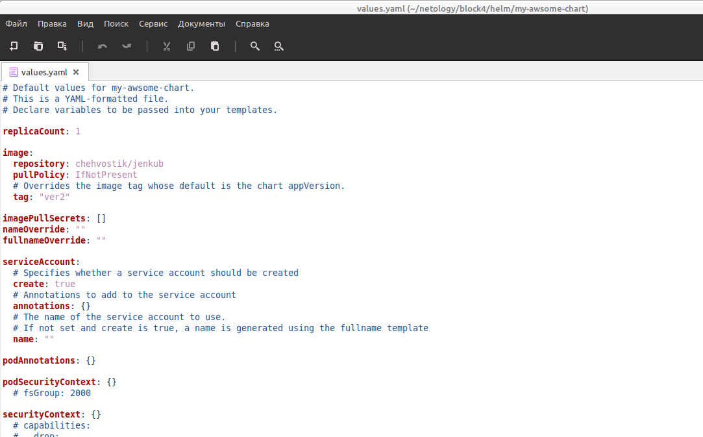

Мой докеробраз находится в моем же репозитории на Dockerhub.

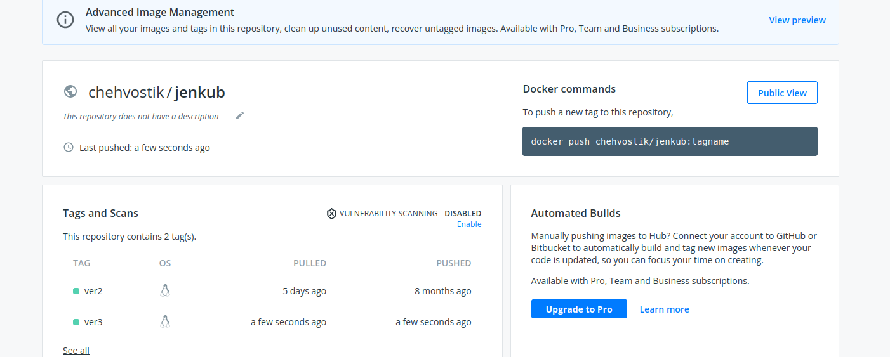

Запустил развертывания своего приложения:

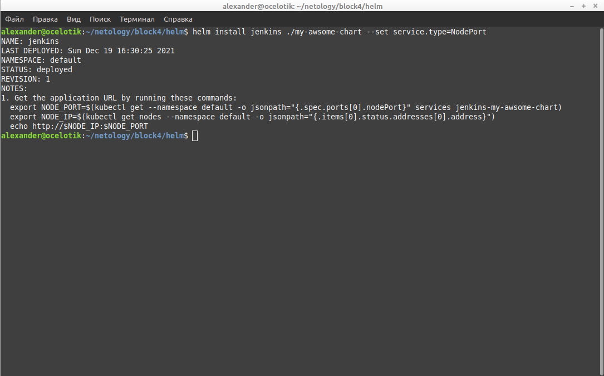
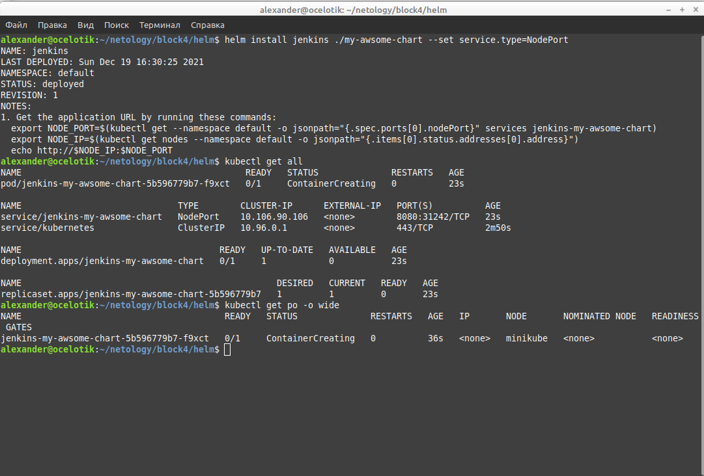

Прбросил порты, чтобы убедиться в работоспособности:

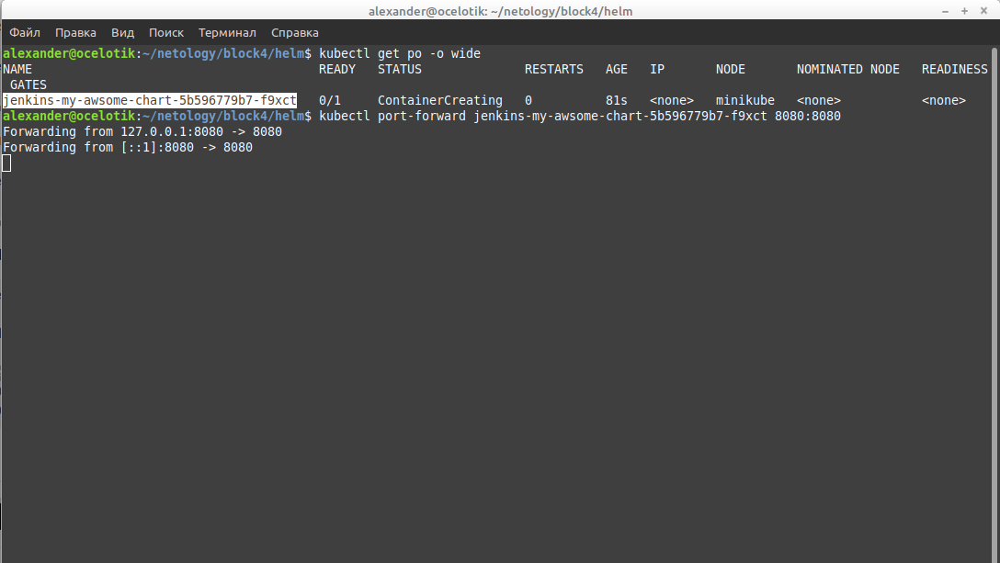
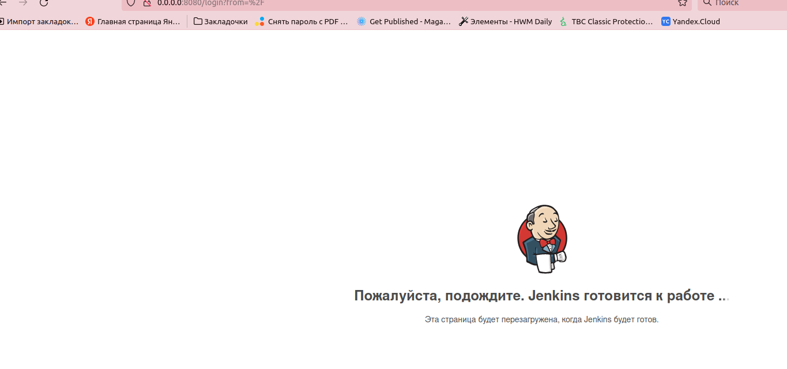
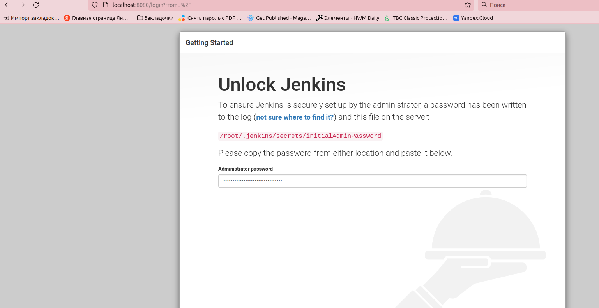

В файле переменных поменял версию приложения, взтую с того же репозитория в Dockerhub, затем, проделал все тоже самое,
что и в пунктах выше:

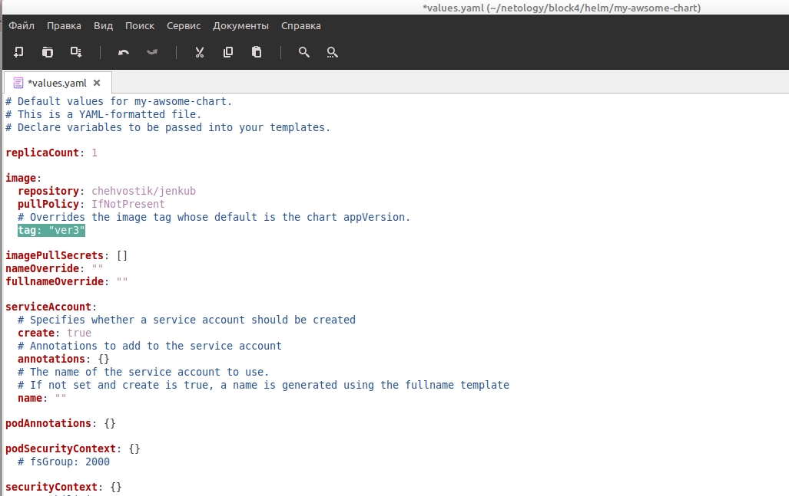
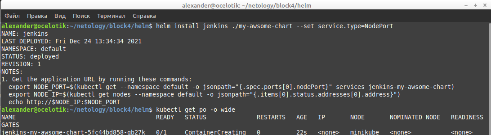
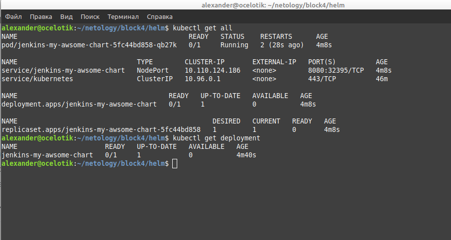

## Задание 2: запустить 2 версии в разных неймспейсах
Подготовив чарт, необходимо его проверить. Попробуйте запустить несколько копий приложения:
* одну версию в namespace=app1;
* вторую версию в том же неймспейсе;
* третью версию в namespace=app2.

## Ответ.

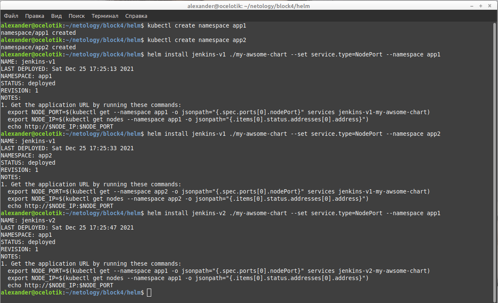
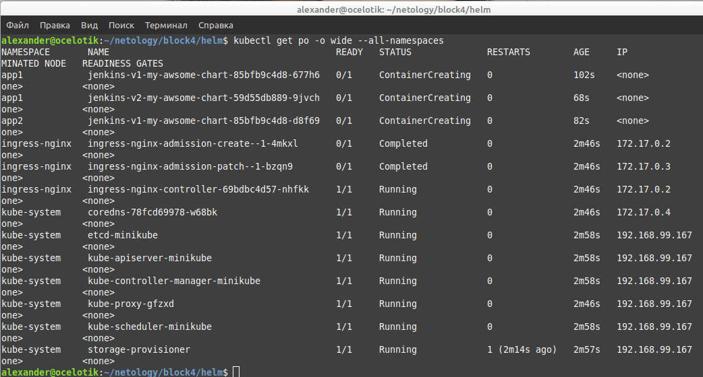

---

### Как оформить ДЗ?

Выполненное домашнее задание пришлите ссылкой на .md-файл в вашем репозитории.

---

---

