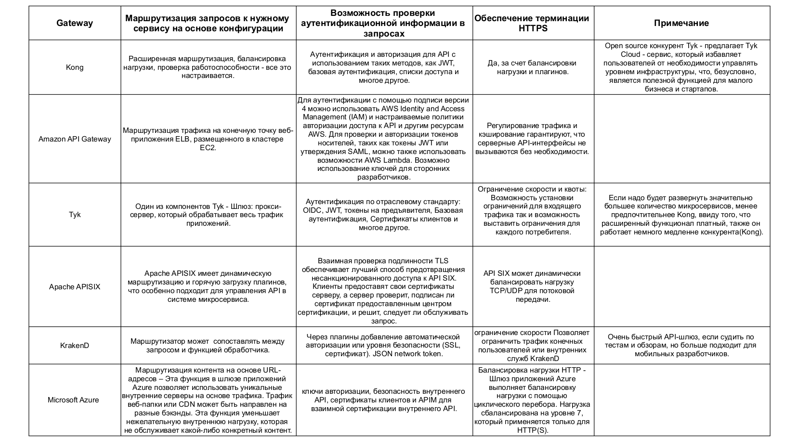
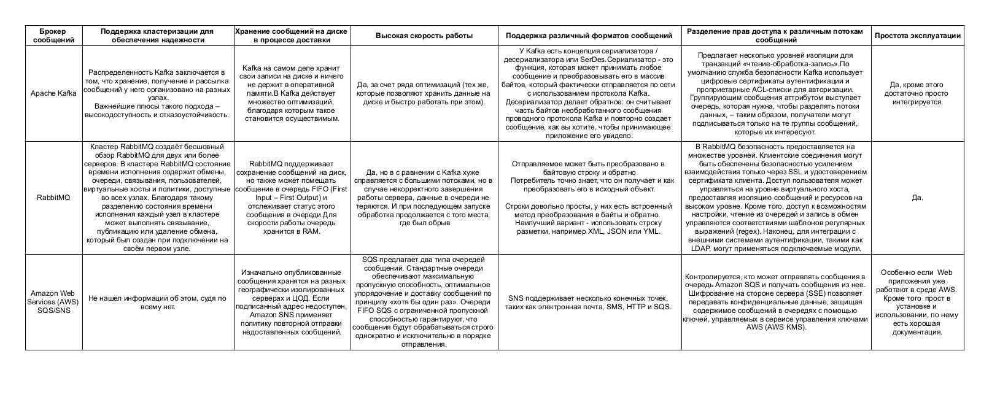

# Домашнее задание к занятию "11.02 Микросервисы: принципы"

Вы работаете в крупной компанию, которая строит систему на основе микросервисной архитектуры.
Вам как DevOps специалисту необходимо выдвинуть предложение по организации инфраструктуры, для разработки и эксплуатации.

## Задача 1: API Gateway 

Предложите решение для обеспечения реализации API Gateway. Составьте сравнительную таблицу возможностей различных программных решений. На основе таблицы сделайте выбор решения.

Решение должно соответствовать следующим требованиям:
- Маршрутизация запросов к нужному сервису на основе конфигурации
- Возможность проверки аутентификационной информации в запросах
- Обеспечение терминации HTTPS

Обоснуйте свой выбор.

Скорее всего выбрал бы или Kong или решение от Apache, первый ввиду его гибкой настройки, скорости и Opensource,
второй, на мой взгляд немного более функционален.

## Задача 2: Брокер сообщений

Составьте таблицу возможностей различных брокеров сообщений. На основе таблицы сделайте обоснованный выбор решения.

Решение должно соответствовать следующим требованиям:
- Поддержка кластеризации для обеспечения надежности
- Хранение сообщений на диске в процессе доставки
- Высокая скорость работы
- Поддержка различных форматов сообщений
- Разделение прав доступа к различным потокам сообщений
- Протота эксплуатации

Обоснуйте свой выбор.

Тут не могу выявить однозначного лидера, если у компании уже много сервисов и приложений в Амазон и есть
финансовая возможность, то можно смело рекомендовать решения от AWS, если компания не желает финансово разоряться и,
при этом, нужна обработка больших потоков сообщений, то предпочтительнее Kafka, если обработки больших потоков не
требуется, то можно выбрать и Rabbit.

---
